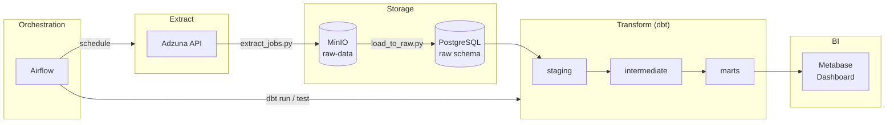

# Job Market Insights

End-to-end ELT pipeline for collecting, transforming, and visualizing job posting data from the Adzuna API. Built with modern analytics engineering practices: raw → staging → intermediate → marts, orchestrated with Airflow, and served through Metabase.

---

## Table of Contents

- [Architecture](#architecture)
- [Tech Stack](#tech-stack)
- [Project Structure](#project-structure)
- [Data Layers (dbt)](#data-layers-dbt)
- [Quick Start](#quick-start)
- [Services & Ports](#services--ports)
- [Airflow DAG](#airflow-dag)
- [Metabase](#metabase)
- [Local Development](#local-development)
- [CI/CD](#cicd)
- [Troubleshooting](#troubleshooting)

---

## Architecture



**Data flow:**

1. **Extract** — Python script pulls job listings from the Adzuna API.
2. **Load** — JSON is stored in MinIO, then loaded into `raw.jobs_raw`.
3. **Transform** — dbt builds staging → intermediate → marts models.
4. **Orchestrate** — Airflow runs the pipeline daily with retries and SLA.
5. **Visualize** — Metabase reads the `marts` schema and renders the dashboard.

---

## Tech Stack

| Category | Technologies |
|---|---|
| Language | Python 3.12 |
| Database | PostgreSQL 15 |
| Object Storage | MinIO (S3-compatible) |
| Transformations | dbt + dbt_utils |
| Orchestration | Apache Airflow 2.9 |
| BI | Metabase |
| Infrastructure | Docker Compose |
| CI | GitHub Actions (sqlfluff + dbt compile) |
| Data Source | [Adzuna API](https://developer.adzuna.com/) |

---

## Project Structure

```
job-market-pipeline/
├── dags/                    # Airflow DAGs
├── dbt_project/             # dbt models and configuration
│   └── models/
│       ├── staging/         # stg_jobs
│       ├── intermediate/    # int_jobs_enriched
│       └── marts/           # dim_*, fct_*, rpt_*
├── extractors/              # Python ETL scripts
├── metabase/                # Dashboard auto-setup
├── docker/                  # Postgres init scripts
├── .github/workflows/       # CI pipeline
├── docker-compose.yml
├── requirements-ci.txt
└── .env.example
```

---

## Data Layers (dbt)

| Layer | Model | Description |
|---|---|---|
| **Staging** | `stg_jobs` | JSON cleanup, surrogate key, deduplication |
| **Intermediate** | `int_jobs_enriched` | Text trimming, location parsing, `salary_avg` |
| **Marts** | `dim_companies` | Company dimension |
| | `dim_locations` | City / region dimension |
| | `fct_job_postings` | Job postings fact table |
| **Reporting** | `rpt_top_skills` | Top 10 in-demand skills |
| | `rpt_salary_by_city` | Salary metrics by city |
| | `rpt_weekly_job_trends` | Weekly job posting trends |
| | `rpt_jobs_by_company` | Job distribution by company |

Marts models are stored in the PostgreSQL schema **`marts`**.

---

## Quick Start

### Prerequisites

- Docker & Docker Compose
- Git
- Adzuna API keys ([get them here](https://developer.adzuna.com/))

### 1. Clone and configure

```bash
git clone <repository-url>
cd job-market-pipeline

cp .env.example .env
# Edit .env: passwords, ADZUNA_APP_ID, ADZUNA_APP_KEY
```

### 2. Airflow UID (Linux / WSL)

```bash
echo "AIRFLOW_UID=$(id -u)" >> .env
mkdir -p logs dags plugins
```

### 3. Start infrastructure

```bash
docker compose up -d postgres minio
docker compose up airflow-init
docker compose up -d airflow-webserver airflow-scheduler
```

### 4. First pipeline run

In the Airflow UI ([http://localhost:8080](http://localhost:8080)), enable the **`job_market_pipeline`** DAG and trigger it manually.

> Default login: `airflow` / `airflow`

### 5. Metabase

```bash
# If the Postgres volume existed before Metabase was added:
docker exec -it jmp_postgres psql -U jmp_user -d job_market -c "CREATE DATABASE metabase;"

docker compose up -d metabase
docker compose run --rm metabase-setup
```

Open [http://localhost:3000](http://localhost:3000) → **Job Market Insights** dashboard.

---

## Services & Ports

| Service | URL | Purpose |
|---|---|---|
| Airflow | [localhost:8080](http://localhost:8080) | Pipeline orchestration |
| Metabase | [localhost:3000](http://localhost:3000) | BI dashboards |
| MinIO Console | [localhost:9001](http://localhost:9001) | Browse raw files |
| MinIO API | `localhost:9000` | S3 endpoint |
| PostgreSQL | `localhost:5433` | `job_market` database (from host) |

---

## Airflow DAG

The **`job_market_pipeline`** DAG runs on a daily schedule (`@daily`):

```
extract_task → dbt_run_task → dbt_test_task → notify_task
```

| Parameter | Value |
|---|---|
| Retries | 2 |
| Retry delay | 5 min |
| SLA | 30 min |
| On failure | Logging via `on_failure_callback` |

---

## Metabase

The **Job Market Insights** dashboard includes four visualizations:

1. **Top 10 Skills by Demand** — bar chart
2. **Weekly Job Posting Trend** — line chart
3. **Salary Distribution by City** — bar chart
4. **Job Postings by Company** — row chart


The PostgreSQL connection (schema `marts`) is configured automatically via `metabase/setup_dashboard.py`.

---

## Local Development

### Python venv + dbt

```bash
python3 -m venv venv
source venv/bin/activate
pip install -r requirements-ci.txt

cp .env.example .env   # if not created yet
set -a && source .env && set +a

cd dbt_project
dbt deps
dbt run --select marts
dbt test --select marts
```

### SQL lint

```bash
cd dbt_project
sqlfluff lint models/
dbt compile --project-dir . --profiles-dir .
```

### Extractors (local)

```bash
cd extractors
python extract_jobs.py
```

> Local runs require `postgres` and `minio` to be up via Docker Compose.

---

## CI/CD

Every Pull Request to `main` / `master` triggers a GitHub Actions workflow:

- `sqlfluff lint` — SQL style checks
- `dbt compile` — model and macro validation

Configuration: [`.github/workflows/ci.yml`](.github/workflows/ci.yml)

---

## Troubleshooting

<details>
<summary><strong>dbt: could not translate host name "postgres"</strong></summary>

`postgres` is the Docker service name. For local runs, set in `.env`:

```bash
POSTGRES_HOST=localhost
POSTGRES_PORT=5433
```

</details>

<details>
<summary><strong>Airflow: Env var POSTGRES_USER not provided</strong></summary>

Ensure `env_file: .env` is set for Airflow in `docker-compose.yml`, then restart:

```bash
docker compose up -d airflow-scheduler airflow-webserver
```

</details>

<details>
<summary><strong>Metabase: empty dashboard</strong></summary>

Run the ELT pipeline and build marts models first:

```bash
cd dbt_project && dbt run --select marts
```

</details>

<details>
<summary><strong>CREATE DATABASE metabase fails (DB already exists)</strong></summary>

The database already exists — that's fine, continue starting Metabase.

</details>
